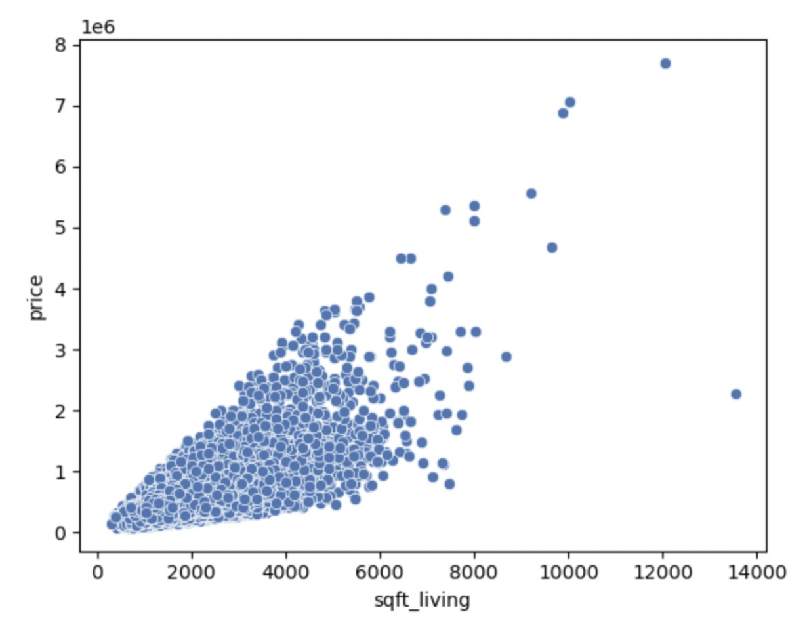

# Deep Learning for Real Estate Price Prediction

This a sale price prediction for Real Estate in King County in USA using the data for hoouse sold between May 2014 to May 2015. The datasets contain features like:
* ida: notation for a house
* date: date of house was sold
* price: target price for each house
* bedrooms: number of bedrooms
* bathrooms: number of bathrooms
* sqft_living: square footage of livable area
* qft_lot: square footage of lot
* floors: number of levels in the house
* waterfront: boolean for waterfront view
* view: boolean for house viewed.
* condition: rating for the house condition
* grade: overall grade given to the housing unit according to King County standards
* sqft_abovesquare: footage of house apart from basement
* sqft_basement: square footage of the basement
* yr_built: Build year
* yr_renovated: Year when house was renovated
* zipcode: zip
* lat: latitue coordinate
* long: longitude coordinate
* sqft_living15: living room area in 2015 (implies some renovations)
* sqft_lot15: lot size area in 2015

Here's the visualization of the dataset for the price vs sqft_living of real estate in King County using Seaborn's `scatterplot()`

We can also visualize how features correlate with each other using heatmap using Seaborn's `heatmap()`. This light and warm color tells us how the two features are mutually connected. For example the light yellow on sqft_living and price tells us the size of the living area affects price.

## Data Sanitation

Using the heatmap, we can choose the appropriate features that can directly affect our price prediciton modes. Then we need to normalize the information we have. We can use sklearn.preprocessing's `MinMaxScaler` to do the scaling for us.

## Train

## Evaluate
